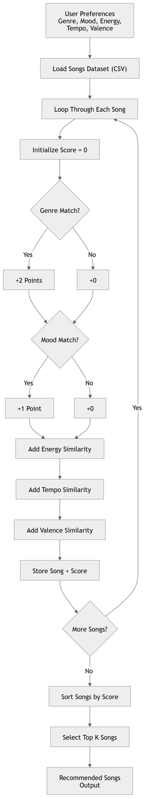

# 🎵 Music Recommender Simulation

## Project Summary

In this project you will build and explain a small music recommender system.

Your goal is to:

- Represent songs and a user "taste profile" as data
- Design a scoring rule that turns that data into recommendations
- Evaluate what your system gets right and wrong
- Reflect on how this mirrors real world AI recommenders

Replace this paragraph with your own summary of what your version does.

---

## How The System Works

My recommendation system is inspired by how platforms like Spotify combine user preferences with song characteristics. Each song is represented using features such as genre, mood, energy, tempo, valence, danceability, and acousticness. The user profile stores their preferences based on liked or frequently played songs, summarized as average feature values. The recommender then computes a similarity score between each song and the user profile, prioritizing songs that are closest to the user’s taste. Finally, the system recommends the top-ranked songs with the highest similarity scores, focusing on matching mood and energy while still allowing some diversity.
To implement this, I define a user profile with a preferred genre (lofi), mood (chill), and target values for energy, tempo, and valence, which act as a reference point for comparison. The system then iterates through each song in the dataset and assigns a score based on how well it matches this profile: it adds +2 points for a genre match and +1 point for a mood match, and computes additional similarity scores for numerical features by measuring how close each song’s energy, tempo, and valence are to the target values. After scoring all songs, the system ranks them from highest to lowest score and selects the top K songs as recommendations. This approach ensures that the recommendations strongly reflect the user’s preferred style while still accounting for nuanced differences in musical characteristics.
This system is biased toward songs that explicitly match the user’s preferred genre and mood, since these features are given the highest weights, which may cause it to overlook songs from other genres that still closely match the user’s numerical preferences. It also assumes that the user’s taste can be accurately captured by average feature values, which can flatten more complex or varied preferences. Additionally, the similarity functions treat all numerical differences linearly, which may not reflect how people actually perceive changes in tempo or energy. Finally, because the dataset is small and manually labeled, any inconsistencies or subjectivity in these labels will directly affect the recommendations.

[](mermaid-diagram.png)

Example of Recommendations
[](recommedations.jpg)
---

## Getting Started

### Setup

1. Create a virtual environment (optional but recommended):

   ```bash
   python -m venv .venv
   source .venv/bin/activate      # Mac or Linux
   .venv\Scripts\activate         # Windows

2. Install dependencies

```bash
pip install -r requirements.txt
```

3. Run the app:

```bash
python -m src.main
```

### Running Tests

Run the starter tests with:

```bash
pytest
```

You can add more tests in `tests/test_recommender.py`.

---

## Experiments You Tried

Use this section to document the experiments you ran. For example:

- What happened when you changed the weight on genre from 2.0 to 0.5
- What happened when you added tempo or valence to the score
- How did your system behave for different types of users

---

## Limitations and Risks

Summarize some limitations of your recommender.

Examples:

- It only works on a tiny catalog
- It does not understand lyrics or language
- It might over favor one genre or mood

You will go deeper on this in your model card.

---

## Reflection

Read and complete `model_card.md`:

[**Model Card**](model_card.md)

Write 1 to 2 paragraphs here about what you learned:

- about how recommenders turn data into predictions
- about where bias or unfairness could show up in systems like this


---

## 7. `model_card_template.md`

Combines reflection and model card framing from the Module 3 guidance. :contentReference[oaicite:2]{index=2}  

```markdown
# 🎧 Model Card - Music Recommender Simulation

## 1. Model Name

Give your recommender a name, for example:

> VibeFinder 1.0

---

## 2. Intended Use

- What is this system trying to do
- Who is it for

Example:

> This model suggests 3 to 5 songs from a small catalog based on a user's preferred genre, mood, and energy level. It is for classroom exploration only, not for real users.

---

## 3. How It Works (Short Explanation)

Describe your scoring logic in plain language.

- What features of each song does it consider
- What information about the user does it use
- How does it turn those into a number

Try to avoid code in this section, treat it like an explanation to a non programmer.

---

## 4. Data

Describe your dataset.

- How many songs are in `data/songs.csv`
- Did you add or remove any songs
- What kinds of genres or moods are represented
- Whose taste does this data mostly reflect

---

## 5. Strengths

Where does your recommender work well

You can think about:
- Situations where the top results "felt right"
- Particular user profiles it served well
- Simplicity or transparency benefits

---

## 6. Limitations and Bias

Where does your recommender struggle

Some prompts:
- Does it ignore some genres or moods
- Does it treat all users as if they have the same taste shape
- Is it biased toward high energy or one genre by default
- How could this be unfair if used in a real product

---

## 7. Evaluation

How did you check your system

Examples:
- You tried multiple user profiles and wrote down whether the results matched your expectations
- You compared your simulation to what a real app like Spotify or YouTube tends to recommend
- You wrote tests for your scoring logic

You do not need a numeric metric, but if you used one, explain what it measures.

---

## 8. Future Work

If you had more time, how would you improve this recommender

Examples:

- Add support for multiple users and "group vibe" recommendations
- Balance diversity of songs instead of always picking the closest match
- Use more features, like tempo ranges or lyric themes

---

## 9. Personal Reflection

A few sentences about what you learned:

- What surprised you about how your system behaved
- How did building this change how you think about real music recommenders
- Where do you think human judgment still matters, even if the model seems "smart"

