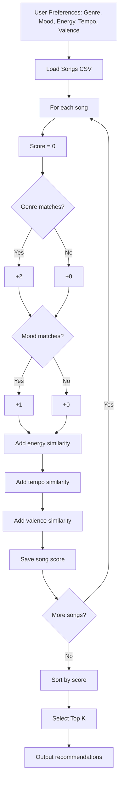

```mermaid
flowchart TD
    A[User Preferences: Genre, Mood, Energy, Tempo, Valence] --> B[Load Songs CSV]
    B --> C[For each song]

    C --> D[Score = 0]
    D --> E{Genre matches?}
    E -- Yes --> F[+2]
    E -- No --> G[+0]

    F --> H{Mood matches?}
    G --> H
    H -- Yes --> I[+1]
    H -- No --> J[+0]

    I --> K[Add energy similarity]
    J --> K

    K --> L[Add tempo similarity]
    L --> M[Add valence similarity]

    M --> N[Save song score]
    N --> O{More songs?}

    O -- Yes --> C
    O -- No --> P[Sort by score]

    P --> Q[Select Top K]
    Q --> R[Output recommendations]
```